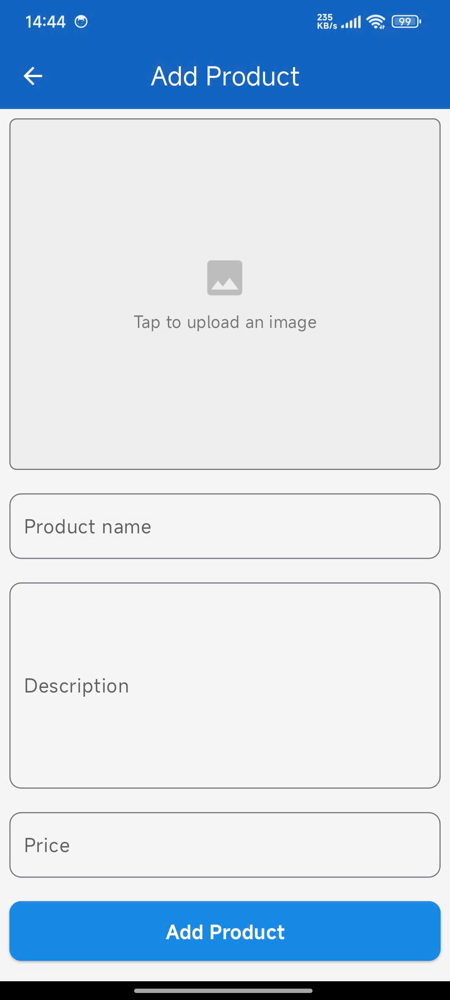

# Flutter Firebase CRUD Example

This project demonstrates a CRUD (Create, Read, Update, Delete) application for managing products using Firebase Firestore for data storage and Firebase Storage for image uploads. The app is built with Flutter and uses Provider for state management and setState for local UI updates.

   
